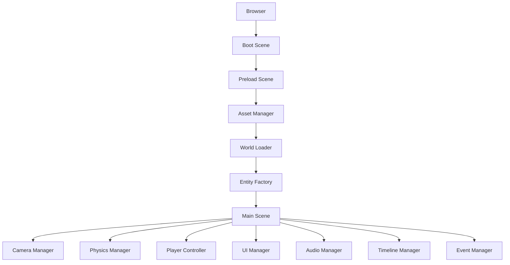

# 🎮 Life Story Engine

> **An interactive side-scrolling storytelling engine inspired by classic platform games.**
>
> Walk through your life, one event at a time.

---

# Running Locally

The game **must be served over `http(s)`** — opening `index.html` directly via `file://` (double-clicking
it, or dragging it into a browser tab) makes the browser block Phaser's `world.json`/`assets.json` loads
under CORS ("origin `null`"), and the game won't boot.

From the `Game/` folder, start any static server, then open the printed `localhost` URL:

```bash
cd Game
python3 -m http.server 8000
# → open http://localhost:8000/index.html
```

(`npx serve`, VS Code's "Live Server" extension, or any other static file server works the same way.)

---

# Overview

Life Story Engine is a data-driven 2D platform framework built with **Phaser 3** and **TypeScript**.

Instead of creating a traditional game, this project creates an interactive presentation where the player explores a world that represents a personal timeline.

As the player advances through the level, important moments of their life appear as interactive objects, allowing them to discover stories, photos, videos, achievements, challenges, and milestones.

Everything is defined through JSON configuration files, allowing non-developers to build or modify an entire presentation without touching the source code.

The engine is inspired by classic platform games such as Super Mario Bros., but it is designed specifically for storytelling rather than gameplay.

---

# Goals

* Create an interactive personal presentation.
* Build a reusable storytelling engine.
* Separate content from code.
* Make every presentation configurable using JSON.
* Support future visual editors.
* Support multimedia storytelling.
* Keep the engine lightweight and easy to customize.

---

# Core Principles

## Data Driven

Every piece of content is loaded from external JSON files.

No event should require source code modifications.

---

## Modular

Every subsystem is isolated.

Examples:

* Rendering
* Physics
* Audio
* Camera
* UI
* Timeline
* Events
* Dialogs

can evolve independently.

---

## Extensible

New object types should be added by creating a new Entity class and registering it.

No engine modifications should be required.

---

## Presentation First

This is **not** a platform game.

The platform mechanics only exist to improve storytelling.

The player's objective is to explore a timeline.

---

# Technology Stack

* TypeScript
* Phaser 3
* Vite
* HTML5
* CSS3
* Canvas / WebGL

Optional future integrations:

* Tiled Editor
* Spine
* GSAP
* Three.js
* Lottie
* PixiJS Filters

---

# Project Structure

```
life-story-engine/
life-game/

 ├── src/
 │
 ├── engine/
 │     CameraManager.ts
 │     PhysicsManager.ts
 │     AssetManager.ts
 │     EventSystem.ts
 │     UIManager.ts
 │     Timeline.ts
 │     SaveManager.ts
 │     AudioManager.ts
 │
 ├── scenes/
 │     BootScene.ts
 │     PreloadScene.ts
 │     MainScene.ts
 │     UIScene.ts
 │
 ├── entities/
 │     Player.ts
 │     Pipe.ts
 │     Mushroom.ts
 │     Life.ts
 │     Trigger.ts
 │     Background.ts
 │     Platform.ts
 │
 ├── components/
 │     SpriteComponent.ts
 │     ColliderComponent.ts
 │     ScriptComponent.ts
 │     AnimationComponent.ts
 │
 ├── scripts/
 │     TriggerScript.ts
 │     CameraScript.ts
 │     TimelineScript.ts
 │
 ├── data/
 │     world.json
 │     events.json
 │     assets.json
 │
 ├── assets/
 │     sprites/
 │     music/
 │     fonts/
 │     images/
 │
 ├── ui/
 │     Modal.ts
 │     HUD.ts
 │     Timeline.ts
 │
 ├── styles/
 │
 ├── public/
 │
 ├── README.md
 │
 └── package.json
README.md
```

---

# Engine Architecture



---

# World System

The world consists of multiple layers.

```
Sky

Clouds

Mountains

Trees

Platforms

Interactive Objects

Player

Foreground

Weather

Lighting
```

Each layer can scroll independently.

Parallax values are configurable.

---

# Camera System

The camera follows the player smoothly.

Features

* Smooth Follow
* Zoom
* Camera Shake
* Fade In
* Fade Out
* Cinematic Pan
* Automatic Focus
* Timeline Zoom

Events can control the camera through JSON.

---

# Player

The player is intentionally simple.

Abilities

* Walk
* Run
* Jump
* Interact

No enemies.

No combat.

No health system.

The player exists only to explore the story.

---

# Interactive Objects

Objects available by default:

* Mushroom
* Extra Life
* Pipe
* Brick Block
* Question Block
* Flag
* Sign
* Portal
* Coin
* Trophy
* Star
* Photo Frame
* Timeline Marker
* Checkpoint
* Dark Zone

Every object is scriptable.

---

# Event System

Every interactive object references an Event.

Example:

```json
{
  "id": "graduation",

  "trigger": "overlap",

  "title": "Graduation",

  "subtitle": "2018",

  "text": "...",

  "images":[
      "1.jpg",
      "2.jpg"
  ],

  "video":"graduation.mp4",

  "audio":"speech.mp3",

  "animation":"zoom",

  "pauseGame":true
}
```

---

# Script Engine

Every object may contain one or more scripts.

Example:

```
Player enters trigger

↓

Play animation

↓

Zoom camera

↓

Pause game

↓

Open modal

↓

Play audio

↓

Wait

↓

Resume game
```

Scripts should be reusable.

---

# UI System

UI is rendered independently from gameplay.

Supported components:

* Modal
* Timeline
* Gallery
* Video Player
* Audio Controls
* Tooltip
* Subtitle
* Notification
* Progress Indicator

---

# Timeline

Every event belongs to a timeline.

Example:

```
1995

↓

Elementary School

↓

High School

↓

University

↓

First Job

↓

Startup

↓

LATAM Airlines

↓

Today
```

The timeline automatically highlights the current milestone.

---

# Dark Zones

Dark Zones represent difficult periods.

Examples

* COVID
* Personal Loss
* Career Challenges
* Burnout
* Failure
* Economic Crisis

Features

* Dark Overlay
* Fog
* Rain
* Ambient Audio
* Reduced Saturation
* Camera Effects

Dark Zones are fully configurable.

---

# Asset System

Assets are loaded dynamically.

```
Backgrounds

Sprites

Animations

Music

Videos

Fonts

Icons

Particle Effects
```

Unused assets are never loaded.

---

# JSON Driven World

Example:

```json
{
    "background":"forest",

    "playerStart":[120,520],

    "objects":[

        {
            "type":"pipe",
            "x":400,
            "y":540
        },

        {
            "type":"mushroom",
            "x":620,
            "y":480,
            "event":"graduation"
        },

        {
            "type":"darkZone",
            "x":2200,
            "width":900
        }

    ]
}
```

---

# Future Visual Editor

The engine is designed to support a visual editor.

Features

* Drag & Drop Objects
* Resize Zones
* Camera Preview
* Live JSON Editing
* Undo / Redo
* Asset Browser
* Timeline Editor
* Event Editor
* Export JSON

No recompilation required.

---

# Future Features

* NPC conversations
* AI-generated narration
* Voice-over support
* Branching timelines
* Multiplayer guided tours
* Cloud synchronization
* Localization
* Controller support
* Touch support
* Mobile optimization
* Accessibility features
* Presentation mode
* Replay mode

---

# Design Philosophy

Life Story Engine is not intended to recreate Super Mario.

Instead, it borrows the visual language of classic platform games to create a memorable and engaging storytelling experience.

Movement replaces slides.

Exploration replaces scrolling through presentations.

Discovery replaces bullet points.

The result is a presentation where every achievement, setback, milestone, and memory becomes part of a world that the audience can experience rather than simply watch.

---

# License

MIT License

---

# Author

Created as a personal interactive storytelling framework.

Designed for presentations, portfolios, resumes, company introductions, conference talks, and personal narratives.
