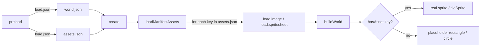

# Asset Reference — Names, Paths & Usage

> The single source of truth for **every asset key**, where its file belongs, and which line of code
> reads it. This documents the system as it is actually implemented in [game.js](../game.js),
> not just the plan — cross-check against Phase 7 ([phase-7-assets-sprites.md](phase-7-assets-sprites.md))
> for the original design rationale.

---

## How it works (read this first)

Nothing in the engine hardcodes "load this PNG." Every visual either:

1. **Reads its key from `data/assets.json`** and, if that key resolves to a loaded texture, renders the
   real sprite — or
2. **Falls back to a colored placeholder primitive** (a `rectangle` or `circle`) when the key isn't
   registered.

That check is one function, used everywhere:

```js
// game.js:61
function hasAsset(key) {
  return !!(scene && key && scene.textures.exists(key));
}
```

So **adding art is always the same two steps**, regardless of category:
1. Drop the file in the path shown below.
2. Add `{ "path": "..." }` under the matching key in [data/assets.json](../data/assets.json).

No entry in `game.js` changes. The placeholder disappears the next time the page loads.

### The loading pipeline



`loadManifestAssets` (game.js:65) walks every category in `assets.json`, queues a `load.image` (or
`load.spritesheet` if `frameWidth`/`frameHeight` are present), and only calls `buildWorld` once that
second load pass finishes — or immediately, if the manifest is empty.

---

## Folder layout

```
Game/
 ├── data/
 │    ├── world.json        ← level content: scenery, milestones, zones, backgrounds
 │    └── assets.json        ← THE MANIFEST — maps asset keys to file paths
 │
 └── assets/
      ├── sprites/
      │    ├── characters/   ← player_idle, player_walk, player_jump
      │    ├── structures/   ← ground, platform, wall, pipe, flag, ...
      │    └── icons/        ← icon_mushroom, icon_star, icon_heart, ...
      ├── images/
      │    ├── backgrounds/  ← bg_sky, bg_clouds, bg_mountains, bg_trees
      │    ├── events/        ← per-event modal images (NOT in the manifest — see below)
      │    └── ui/            ← reserved, not yet wired into code
      ├── music/               ← reserved for Phase 8 (audio manager)
      ├── sfx/                 ← reserved for Phase 8
      └── fonts/               ← reserved, not yet wired into code
```

All paths in `assets.json` are **relative to `Game/`** (i.e. relative to `index.html`), because Phaser's
loader resolves against the page URL and the game is served from `Game/` as the web root.

---

## Naming convention

| Rule | Example |
|------|---------|
| Keys are `snake_case` | `player_idle`, `icon_star` |
| Structure keys = the literal `type` string used in `world.json`'s `scenery[]` | `type: "pipe"` → key `pipe` |
| Icon keys = `icon_` + the literal `icon` string used in `world.json`'s `milestones[]` | `icon: "trophy"` → key `icon_trophy` |
| Background keys = the literal `key` string used in `world.json`'s `background[]` | `key: "bg_clouds"` → key `bg_clouds` |
| Character keys are **fixed** — always exactly these three | `player_idle`, `player_walk`, `player_jump` |

Because structure/icon/background keys are read straight out of `world.json`, **adding a brand-new type
(e.g. a `"sign"` structure or a `"coin"` icon) needs no code change** — just use the new string in
`world.json` and add a matching manifest entry (plus, ideally, a placeholder color — see below).

---

## `data/assets.json` schema

```json
{
  "characters": {
    "<key>": { "path": "assets/sprites/characters/<file>.png" },
    "<spritesheet_key>": { "path": "assets/sprites/characters/<file>.png",
                            "frameWidth": 32, "frameHeight": 48 }
  },
  "structures": { "<key>": { "path": "assets/sprites/structures/<file>.png" } },
  "icons":      { "<key>": { "path": "assets/sprites/icons/<file>.png" } },
  "backgrounds":{ "<key>": { "path": "assets/images/backgrounds/<file>.png" } }
}
```

- **`path`** (required) — file location, relative to `Game/`.
- **`frameWidth` + `frameHeight`** (optional) — presence of *both* makes `loadManifestAssets` call
  `load.spritesheet` instead of `load.image`, enabling `scene.anims.generateFrameNumbers(key)`. Only
  `player_walk` uses this today (game.js:172-179).
- An empty category (`{}`) is valid — everything in it just stays on placeholders.
- The top-level `"_comment"` key is ignored by the loader (any non-object value is skipped).

---

## Characters — `assets/sprites/characters/`

Read in `buildPlayer()`, game.js:166-188.

| Key | Suggested file | Size | Spritesheet? | Placeholder if missing | Used by |
|-----|-----------------|------|--------------|--------------------------|---------|
| `player_idle` | `player_idle.png` | 32×48 | no | blue rectangle `#1E90FF`, 32×48 | Base player texture |
| `player_walk` | `player_walk.png` | 32×48 ×N frames | **yes** — needs `frameWidth: 32, frameHeight: 48` | walk animation simply never plays; texture stays on `player_idle` (or the placeholder) | `anims.create('walk', ...)`, played in `update()` when grounded + moving |
| `player_jump` | `player_jump.png` | 32×48 | no | texture doesn't switch when airborne | Swapped in via `setTexture()` while `!touching.down` |

**Note:** the player only becomes a real `Sprite` (capable of animating/flipping) once `player_idle`
exists. Until then it's a `Rectangle` — `setFlipX`/`anims` calls are guarded (`if (player.setFlipX)`) so
nothing throws, but direction-facing and animation are silently no-ops on the placeholder.

---

## Structures / builds — `assets/sprites/structures/`

Read in `buildScenery()`, game.js:139-161. Rendered as a `tileSprite` (tileable, top-left origin) when
present.

| Key | Suggested file | Size | Placeholder color | `world.json` `scenery[].type` |
|-----|-----------------|------|---------------------|-------------------------------|
| `ground` | `ground.png` | 32×32 tileable | `#4CAF50` (grass green) | `"ground"` |
| `platform` | `platform.png` | 32×32 tileable | `#8B4513` (brown) | `"platform"` |
| `wall` | `wall.png` | 32×32 | `#2E7D32` (dark green) | `"wall"` |
| `pipe` | `pipe.png` | 64×96 | `#2E7D32` (dark green) | `"pipe"` |
| `flag` | `flag.png` | 32×128 | `#FFD700` (gold) | `"flag"` — decorative goal marker, **not collidable** (game.js:152-154) |
| *(any new type)* | — | — | falls back to `#8B4513` if not in `SCENERY_PLACEHOLDER_COLOR` | add the color in game.js:131-137 for a distinct placeholder |

Current sample content in [data/world.json](../data/world.json) uses all five types (ground, two
platforms, one wall, one pipe, one flag at the goal line).

---

## Interactive icons — `assets/sprites/icons/`

Read in `buildMilestones()`, game.js:201-225. Rendered as a plain `Sprite` (not tiled) when present; each
one floats via a looping tween regardless of placeholder/real art.

| Key | Suggested file | Size | Placeholder color | `world.json` `milestones[].icon` |
|-----|-----------------|------|---------------------|-----------------------------------|
| `icon_mushroom` | `mushroom.png` | 40×40 | `#FF0000` (red) | `"mushroom"` |
| `icon_star` | `star.png` | 40×40 | `#FFD700` (yellow) | `"star"` |
| `icon_heart` | `heart.png` | 40×40 | `#FF69B4` (pink) | `"heart"` |
| `icon_trophy` | `trophy.png` | 40×40 | `#FFA500` (orange) | `"trophy"` |
| `icon_coin` | `coin.png` | 32×32 | `#FFD700` (yellow) | `"coin"` |
| *(any new icon)* | — | — | falls back to `#FF0000` if not in `ICON_PLACEHOLDER_COLOR` | add the color in game.js:193-199 |

Current sample content in `world.json` uses `mushroom`, `star` (×2), `heart`, and `trophy`.

---

## Backgrounds (parallax) — `assets/images/backgrounds/`

Read in `buildBackground()`, game.js:116-129. Rendered as a scrolling `tileSprite`; **the base sky
rectangle is always present underneath** as the Phase 5 fade target, so a background layer with no art
simply leaves that solid color showing.

| Key | Suggested file | Size | `world.json` `background[].parallax` | Notes |
|-----|-----------------|------|----------------------------------------|-------|
| `bg_sky` | `sky.png` | ≥1920×1080 | `0.0` (fixed) | Overlays the fallback `#87CEEB` rect once present |
| `bg_clouds` | `clouds.png` | tileable | `0.2` | |
| `bg_mountains` | `mountains.png` | tileable | `0.4` | |
| `bg_trees` | `trees.png` | tileable | `0.7` | |

**Dark Zone fade caveat:** `fadeSky()` (game.js:255-267) tints `backgroundRect.fillColor` — the fallback
rectangle, not the `bg_sky` image layer. As long as `bg_sky` stays unset, the fade is fully visible. Once
`bg_sky` art is added it will render *over* the tinting rectangle and visually mask the Dark Zone fade —
see the note in [phase-5-transitions-darkzones.md](phase-5-transitions-darkzones.md#4-optional-dark-zone-extras-data-flagged)
about tinting the sky layer or overlaying a fading dark rect instead once real sky art exists.

---

## Event images — `assets/images/events/` (not manifest-driven)

Unlike everything above, event images are **not** registered in `assets.json` and **not** preloaded by
Phaser. `openEventModal()` sets them directly as a DOM `` source, one slide of a small carousel:

```js
img.src = slide.path;   // plain browser fetch, happens when the modal opens / the carousel steps
```

| Where it's set | Field | Behavior |
|------------------|-------|----------|
| `world.json` → `milestones[].event.images` | `[{ path, caption }, ...]` | preferred: one slide per entry, each with its own caption. Nav arrows/dots appear only with 2+ slides. |
| `world.json` → `milestones[].event.imagePath` | any path or URL | legacy single-image form, still supported; treated as a one-slide gallery with no caption. Ignored if `images` is also set. |

**Convention:** put files under `assets/images/events/<event-id>/` (or flat under `assets/images/events/`)
and reference them from the matching milestone's `event.images`. The `education` milestone in `world.json`
is the live example (`assets/images/events/2019/wosniak.jpg`); the other sample milestones still ship with
`imagePath: ""` (carousel hidden entirely) and `title`/`text` marked `TODO`.

---

## Audio — `assets/music/` and `assets/sfx/`

Audio goes through the **same manifest** as everything else, but `loadManifestAssets()` branches on the
file extension rather than the category name:

```js
// game.js — AUDIO_EXT = /\.(mp3|ogg|wav|m4a)$/i
if (AUDIO_EXT.test(def.path)) sceneRef.load.audio(key, def.path);
```

So a sound registered under *any* category loads correctly; the `"music"` / `"sfx"` groupings in
`assets.json` are purely for readability. Everything else is owned by
[sound_manager.js](../sound_manager.js) (`window.SoundManager`), loaded as a plain script **before**
`game.js`.

The audio equivalent of `hasAsset()` is `SoundManager.hasSound(key)` — `hasAsset()` checks
`scene.textures` and always answers `false` for a sound. **Every** `SoundManager` entry point is guarded
by it, so a missing file is silent, never an error: the game runs identically with all five audio files
deleted.

| Key | File | Plays when |
|-----|------|------------|
| `music_game` | `assets/music/music_game.mp3` | Begin ▶ pressed — loops for the whole run, fades in over 800 ms |
| `sfx_start` | `assets/sfx/start.mp3` | Begin ▶ pressed (this click is also the WebAudio unlock gesture) |
| `sfx_bonus` | `assets/sfx/bonus.mp3` | A milestone is reached, and again at The End |
| `sfx_walk_grass` | `assets/sfx/walk_grass.mp3` | Walking on `ground` |
| `sfx_walk_stone` | `assets/sfx/walk_stone.mp3` | Walking on `platform`, `wall`, or `pipe` |

**Footsteps** are surface-aware. `buildScenery()` tags each piece with `piece.sceneryType`, and the
player/platform collider callback `trackSurface()` reports it to `SoundManager.setSurface()` — guarded by
`player.body.touching.down`, so brushing a wall sideways doesn't flip the footsteps to stone. The mapping
lives in `SURFACE_SFX` in `sound_manager.js`; **an unlisted scenery type falls back to grass**, so a new
`"type"` in `world.json` needs no audio change. Each footstep sound is played as a single looping
instance started/stopped on the walk transition (`FOOTSTEP_MODE = 'loop'`), because the two recordings
are very different lengths and no one step interval fits both.

**Music vs. modals:** `enterMilestone()` calls `duckForModal()` — music fades out over 400 ms and
*pauses*; `closeModal()` calls `unduckAfterModal()`, which resumes from the same position and fades back
in. So the modal is read in silence without the track restarting.

**Per-zone music** is wired but dormant. `updateZones()` calls
`SoundManager.crossfadeMusic(zone.music, zone.fadeMs || 800)` — the same `fadeMs` that drives the sky
crossfade, per the Phase 8 spec. All three zones in `world.json` name `music_dark`, which has no file
yet, so `hasSound()` makes it a no-op today. Dropping `music_dark.mp3` into `assets/music/` and adding it
to the manifest is enough to switch it on — **no code change**.

**Volume** is two sliders (Music / Effects) in the `#settings-layer` modal, opened by the ⚙ button or
`Esc`. Each sound's final level is `<slider> × <its base level in BASE_VOLUME>`, and the two slider
values are persisted to `localStorage` under `bio_game_audio` — necessary because the Restart button does
a `location.reload()`.

---

## Reserved, not yet wired into code

These folders exist (per the Phase 0 skeleton) but nothing in `game.js` reads them yet:

| Folder | Intended use | Status |
|--------|----------------|--------|
| `assets/music/` | background tracks, cross-faded per zone | ✅ implemented — see Audio above (`music_dark` still needs a file) |
| `assets/sfx/` | footsteps / milestone / start stings | ✅ implemented — see Audio above |
| `assets/images/ui/` | themed modal frame, button skin, timeline dots | ⬜ not implemented |
| `assets/fonts/` | custom webfont for headings/UI | ⬜ not implemented |

See [phase-8-polish-presentation.md](phase-8-polish-presentation.md) for the rest of the planned hookup.

---

## Cheat sheet: "I want to add a new..."

| Goal | Steps |
|------|-------|
| **Replace the player** | Add `player_idle` (and optionally `player_walk` with `frameWidth`/`frameHeight`, `player_jump`) to `assets.json` → `characters`. Drop files in `assets/sprites/characters/`. |
| **Replace a structure's art** (e.g. all pipes) | Add key `pipe` under `assets.json` → `structures`, pointing at a tileable PNG in `assets/sprites/structures/`. |
| **Add a brand-new structure type** (e.g. `"crate"`) | Use `"type": "crate"` in `world.json` scenery; add a `crate: 0x...` line to `SCENERY_PLACEHOLDER_COLOR` (game.js:131) for a placeholder color; optionally add `crate` to `assets.json` → `structures` for real art. |
| **Add a brand-new milestone icon** (e.g. `"diploma"`) | Use `"icon": "diploma"` in a milestone; add `diploma: 0x...` to `ICON_PLACEHOLDER_COLOR` (game.js:193); optionally add `icon_diploma` to `assets.json` → `icons`. |
| **Add a parallax background layer** | Add an entry to `world.json` → `background[]` with a new `key` + `parallax` value; add that same key to `assets.json` → `backgrounds`. |
| **Add a photo to a milestone's modal** | Put the file in `assets/images/events/`, set `event.imagePath` in `world.json` to that path. No manifest entry needed. |
| **Add a photo carousel (multiple images) to a milestone's modal** | Put the files in `assets/images/events/`, set `event.images` in `world.json` to `[{ "path": "...", "caption": "..." }, ...]`. Prev/Next arrows and dots appear automatically for 2+ slides. |
| **Give the player a walk cycle** | Provide a horizontal spritesheet, set `frameWidth`/`frameHeight` in the `assets.json` entry for `player_walk` to match one frame's dimensions. |

---

## Full status snapshot (fill in as art lands)

This mirrors the tables above in one place for quick scanning — check off `data/assets.json` and this
table together as files are added.

| Category | Key | Status |
|----------|-----|--------|
| Characters | `player_idle` | ⬜ |
| Characters | `player_walk` | ⬜ |
| Characters | `player_jump` | ⬜ |
| Structures | `ground` | ⬜ |
| Structures | `platform` | ⬜ |
| Structures | `wall` | ⬜ |
| Structures | `pipe` | ⬜ |
| Structures | `flag` | ⬜ |
| Icons | `icon_mushroom` | ⬜ |
| Icons | `icon_star` | ⬜ |
| Icons | `icon_heart` | ⬜ |
| Icons | `icon_trophy` | ⬜ |
| Backgrounds | `bg_sky` | ⬜ |
| Backgrounds | `bg_clouds` | ⬜ |
| Backgrounds | `bg_mountains` | ⬜ |
| Backgrounds | `bg_trees` | ⬜ |
| Music | `music_game` | ✅ |
| Music | `music_dark` | ⬜ (referenced by all 3 zones in `world.json`, no file yet) |
| SFX | `sfx_start` | ✅ |
| SFX | `sfx_bonus` | ✅ |
| SFX | `sfx_walk_grass` | ✅ |
| SFX | `sfx_walk_stone` | ✅ |
| Event images | one per milestone in `world.json` | ⬜ (5 milestones, all currently empty) |
