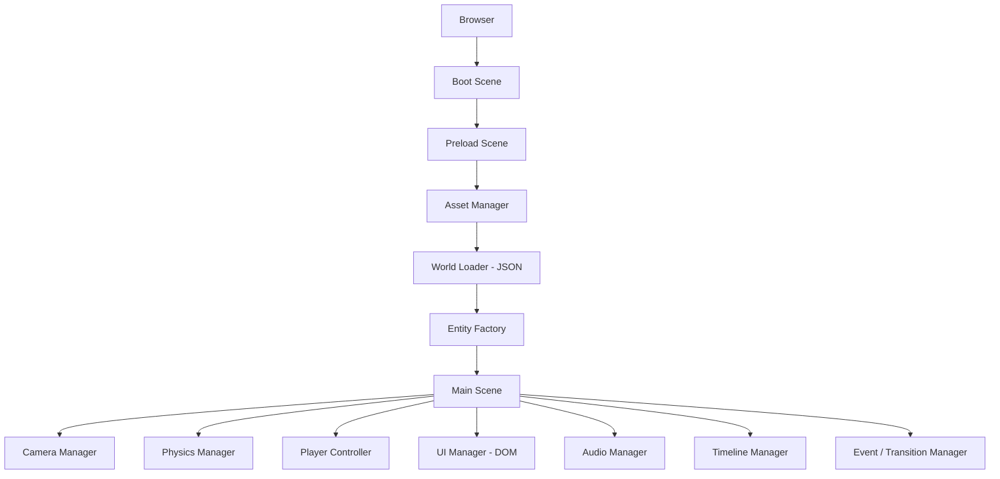

# Phase 0 — Overview & Roadmap

> **Life Story Engine** — a data-driven, side-scrolling *biographical* presentation built with **Phaser 3**.
> The player walks through a personal/company timeline; milestones appear as interactive objects; difficult
> periods appear as **Dark Zones** with a smooth color-fade transition.

This folder breaks the build into sequential **phases**. Each phase is self-contained: it lists its goals,
the files it touches, the acceptance criteria, and — where relevant — **sprite slots** you fill in later.

---

## Phase Map

| Phase | File | Focus | Depends on |
|-------|------|-------|-----------|
| 0 | [phase-0-overview.md](phase-0-overview.md) | Roadmap, conventions, sprite-slot system | — |
| 1 | [phase-1-foundation.md](phase-1-foundation.md) | Project setup, HTML shell, Phaser boot | 0 |
| 2 | [phase-2-core-engine.md](phase-2-core-engine.md) | Scene lifecycle, camera, physics, player | 1 |
| 3 | [phase-3-world-data.md](phase-3-world-data.md) | JSON-driven world, scenery, parallax layers | 2 |
| 4 | [phase-4-interactive-events.md](phase-4-interactive-events.md) | Milestones, overlap detection, event data | 3 |
| 5 | [phase-5-transitions-darkzones.md](phase-5-transitions-darkzones.md) | **Scene transitions (Option 1)** + Dark Zones | 4 |
| 6 | [phase-6-ui-modals.md](phase-6-ui-modals.md) | DOM modal, HUD, timeline, gallery | 4 |
| 7 | [phase-7-assets-sprites.md](phase-7-assets-sprites.md) | Sprite pipeline, atlases, animations | 2–6 |
| 8 | [phase-8-polish-presentation.md](phase-8-polish-presentation.md) | Audio, presentation mode, export | 5–7 |
| 📎 | [asset-reference.md](asset-reference.md) | **Living reference** — every asset key, its path, placeholder, and exact line of code that reads it | reflects current `game.js` |

---

## Architecture (target)

The current prototype (`Option1/`) collapses these managers into a single `game.js`. Phases 1–8 progressively
split that prototype into the modular structure documented in [README.md](README.md).

---

## Conventions

### File & asset naming
- Sprites: `assets/sprites/<category>/<name>_<state>.png` — e.g. `characters/player_idle.png`.
- Backgrounds: `assets/images/backgrounds/<name>.png`.
- Data: `data/world.json`, `data/events.json`, `data/assets.json`.
- Asset keys in code are `snake_case` and match the filename stem (`player_idle`).

### Coordinate system
- World units = **pixels**. `worldWidth` is defined in `config` (prototype uses `4000`).
- The camera follows the player horizontally (`startFollow(player, true, 0.08, 0.08)`).
- Y grows **downward** (Phaser default). Ground sits near the bottom (`y ≈ 550`).

---

## The Sprite-Slot System

Every art-facing phase includes one or more **Sprite Slot tables**. A slot is a reserved hook: the engine
already references the `key`, so dropping a file at the given path + registering the key in `data/assets.json`
makes the art appear — no logic changes.

**Legend:** ⬜ TODO · 🟨 placeholder (colored rectangle/circle) · ✅ final art in place.

Standard slot table shape (used throughout these docs):

| Slot | Asset key | Path | Size (px) | Anim frames | Status |
|------|-----------|------|-----------|-------------|--------|
| _description_ | `snake_key` | `assets/.../____.png` | `W×H` | 1 or N | ⬜ |

> While a slot is ⬜/🟨 the engine draws the **placeholder primitive** noted in the phase (e.g. a blue
> rectangle for the player). Swap to ✅ by adding the file and setting the key — see
> [phase-7-assets-sprites.md](phase-7-assets-sprites.md).

---

## Global Asset Register (fill as you go)

This is the master index every phase's slots roll up into. Keep it in sync with `data/assets.json`.

### Characters
| Asset key | Path | Size | Status |
|-----------|------|------|--------|
| `player_idle` | `assets/sprites/characters/____.png` | 32×48 | ⬜ |
| `player_walk` | `assets/sprites/characters/____.png` | 32×48 ×N | ⬜ |
| `player_jump` | `assets/sprites/characters/____.png` | 32×48 | ⬜ |

### Structures / Builds
| Asset key | Path | Size | Status |
|-----------|------|------|--------|
| `ground_tile` | `assets/sprites/structures/____.png` | 32×32 | ⬜ |
| `platform` | `assets/sprites/structures/____.png` | 64×20 | ⬜ |
| `pipe` | `assets/sprites/structures/____.png` | 64×96 | ⬜ |
| `wall_block` | `assets/sprites/structures/____.png` | 32×32 | ⬜ |
| `flag` | `assets/sprites/structures/____.png` | 32×128 | ⬜ |

### Backgrounds (parallax)
| Asset key | Path | Size | Parallax | Status |
|-----------|------|------|----------|--------|
| `bg_sky` | `assets/images/backgrounds/____.png` | ≥1920×1080 | 0.0 | ⬜ |
| `bg_clouds` | `assets/images/backgrounds/____.png` | tileable | 0.2 | ⬜ |
| `bg_mountains` | `assets/images/backgrounds/____.png` | tileable | 0.4 | ⬜ |
| `bg_trees` | `assets/images/backgrounds/____.png` | tileable | 0.7 | ⬜ |

### Interactive icons
| Asset key | Path | Size | Status |
|-----------|------|------|--------|
| `icon_mushroom` | `assets/sprites/icons/____.png` | 40×40 | ⬜ |
| `icon_star` | `assets/sprites/icons/____.png` | 40×40 | ⬜ |
| `icon_heart` | `assets/sprites/icons/____.png` | 40×40 | ⬜ |

---

## Definition of Done (whole project)
- [ ] All 8 phases pass their individual acceptance criteria.
- [ ] The game runs from a static server with no console errors.
- [ ] Every event, zone, and asset is defined in JSON — zero hardcoded content.
- [ ] Every Sprite Slot is ✅ or intentionally left 🟨 as a stylistic choice.
- [ ] Dark-zone transitions fade smoothly (Option 1 behavior).
